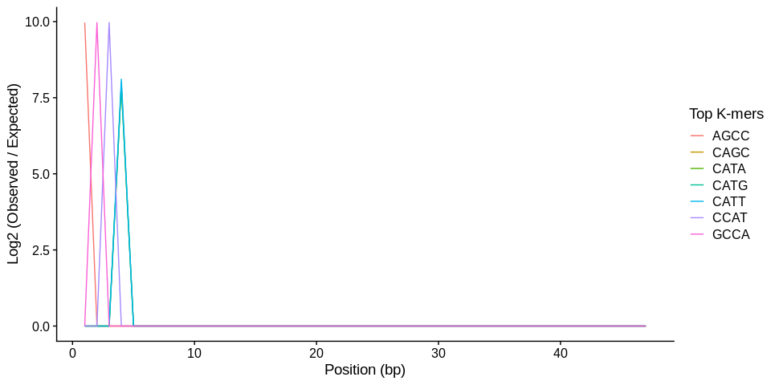

What is a kmer? And why do we count them?
================
8/4/2020

### Overview

The purpose of the markdown is to address the two questions within the
title within the broad context of genomics. More specifically, why it’s
often important when thinking about processing sequence data from
genomics projects and performing early quality control and mapping steps
to consider k-mers, k-mer counting, and k-mer spectra.

### So what is a k-mer? And why to we count them?

A K-mer is a sequence of bases equal to `k`. K-mer counting often refers
to the summation of each unique k-mer in a large section of sequence.
For example, we might count the number of unique 3-mer (K=3) across the
whole genome of an organism. This would amount to a manager number of
bins (4x4x4=64), but depending on the size of the genome we expect the
number of observations for each k-mers to be very larger. When we look
at the distribution of the k-mers in sequence data from an experiment it
can be a powerful tool for identifying whether there are overrepresented
parts of our data (i.e. particular k-mers that have much high
representation in our data than expected).

Here is an example of a K = 3, k-mer;

    ## [1] "Sequence: TCATCATTAT"

`K = 3`

    ## [1] "Sequence:   TCATCATTAT"
    ## [1] "3mer 0 :    TCA"
    ## [1] "3mer 1 :     CAT"
    ## [1] "3mer 2 :      ATC"
    ## [1] "3mer 3 :       TCA"
    ## [1] "3mer 4 :        CAT"
    ## [1] "3mer 5 :         ATT"
    ## [1] "3mer 6 :          TTA"
    ## [1] "3mer 7 :           TAT"

<table class="table" style="margin-left: auto; margin-right: auto;">

<thead>

<tr>

<th style="text-align:left;">

pos\_0

</th>

<th style="text-align:left;">

pos\_1

</th>

<th style="text-align:left;">

pos\_2

</th>

<th style="text-align:left;">

pos\_3

</th>

<th style="text-align:left;">

pos\_4

</th>

<th style="text-align:left;">

pos\_5

</th>

<th style="text-align:left;">

pos\_6

</th>

<th style="text-align:left;">

pos\_7

</th>

</tr>

</thead>

<tbody>

<tr>

<td style="text-align:left;">

TCA

</td>

<td style="text-align:left;">

CAT

</td>

<td style="text-align:left;">

ATC

</td>

<td style="text-align:left;">

TCA

</td>

<td style="text-align:left;">

CAT

</td>

<td style="text-align:left;">

ATT

</td>

<td style="text-align:left;">

TTA

</td>

<td style="text-align:left;">

TAT

</td>

</tr>

</tbody>

</table>

<table class="table" style="margin-left: auto; margin-right: auto;">

<thead>

<tr>

<th style="text-align:right;">

ATC

</th>

<th style="text-align:right;">

ATT

</th>

<th style="text-align:right;">

CAT

</th>

<th style="text-align:right;">

TAT

</th>

<th style="text-align:right;">

TCA

</th>

<th style="text-align:right;">

TTA

</th>

</tr>

</thead>

<tbody>

<tr>

<td style="text-align:right;">

1

</td>

<td style="text-align:right;">

1

</td>

<td style="text-align:right;">

2

</td>

<td style="text-align:right;">

1

</td>

<td style="text-align:right;">

2

</td>

<td style="text-align:right;">

1

</td>

</tr>

</tbody>

</table>

Same sequence but with a `K = 4`;

    ## [1] "Sequence:   TCATCATTAT"
    ## [1] "4mer 0 :    TCAT"
    ## [1] "4mer 1 :     CATC"
    ## [1] "4mer 2 :      ATCA"
    ## [1] "4mer 3 :       TCAT"
    ## [1] "4mer 4 :        CATT"
    ## [1] "4mer 5 :         ATTA"
    ## [1] "4mer 6 :          TTAT"

<table class="table" style="margin-left: auto; margin-right: auto;">

<thead>

<tr>

<th style="text-align:left;">

pos\_0

</th>

<th style="text-align:left;">

pos\_1

</th>

<th style="text-align:left;">

pos\_2

</th>

<th style="text-align:left;">

pos\_3

</th>

<th style="text-align:left;">

pos\_4

</th>

<th style="text-align:left;">

pos\_5

</th>

<th style="text-align:left;">

pos\_6

</th>

</tr>

</thead>

<tbody>

<tr>

<td style="text-align:left;">

TCAT

</td>

<td style="text-align:left;">

CATC

</td>

<td style="text-align:left;">

ATCA

</td>

<td style="text-align:left;">

TCAT

</td>

<td style="text-align:left;">

CATT

</td>

<td style="text-align:left;">

ATTA

</td>

<td style="text-align:left;">

TTAT

</td>

</tr>

</tbody>

</table>

<table class="table" style="margin-left: auto; margin-right: auto;">

<thead>

<tr>

<th style="text-align:right;">

ATCA

</th>

<th style="text-align:right;">

ATTA

</th>

<th style="text-align:right;">

CATC

</th>

<th style="text-align:right;">

CATT

</th>

<th style="text-align:right;">

TCAT

</th>

<th style="text-align:right;">

TTAT

</th>

</tr>

</thead>

<tbody>

<tr>

<td style="text-align:right;">

1

</td>

<td style="text-align:right;">

1

</td>

<td style="text-align:right;">

1

</td>

<td style="text-align:right;">

1

</td>

<td style="text-align:right;">

2

</td>

<td style="text-align:right;">

1

</td>

</tr>

</tbody>

</table>

Notice how there are 1 fewer `4mer` than `3mers` in the same sequence.
Any sequence of length `L` will contain `L - k + 1 k-mers`, which has
implications for k-mer analyses when k is close to the length of the
sequence.

When \(k << L\) we expect that there should be an equal chance of a
specific k-mer at any position. We can look for violations of this
expectation to discover potential biases our data.

Check out this page for more of an introduction on k-mers
[LINK](https://bioinfologics.github.io/post/2018/09/17/k-mer-counting-part-i-introduction/)

### Specific Case : K-mers spectra in sequence mapping (e.g. `FASTQC`)

Looking for k-mer bias in sequence data is a common use for k-mers. The
idea is you count the number of observations for each k-mer at each
position and see if the number of observations exceeds the expected
number of k-mers. In general, this expected number should be equal to
the probability of any one k-mer being selected times the number of
reads. K-mers with very large observed/expected ratios are said to be
biased at this that position. As an example, when looking at read data
from an illumina platform, we expect that the first few based of the
read prior to trimming are the adapters, meaning we expect an over
abundance of specific k-mers at these initial positions along the read
assuming not trimming). Programs like `FASTQC` will examine the
distribution of k-mers along a standardized model of a read (i.e. 150 bp
model, if that was the sequence length used), and create a plot to look
at the most biased k-mers are where they are positioned along the model.

Here is a simple toy example to visualize this, consider 1000 50bp reads
from a single samples with adapter still attached:

    ## [1] "Adapter  : CAGCCAT"

    ## [1] "First 20 reads: "

    ## [1] "Read: CAGCCATACGTAGTCAGCCCGGGGTGACGTATCGTGACATCATCGCAGTC"
    ## [1] "Read: CAGCCATGATATATAGGAATGATTCGCCGATAAAGGGCCGATTCCGGATT"
    ## [1] "Read: CAGCCATGTGTAGATGAACTTTAGCGAGGGACCTTTAGTTAGTGTGTCGA"
    ## [1] "Read: CAGCCATTAGTGCACACGCAGTCGAGTTCGGAGTTTACCAAAGGTGACAA"
    ## [1] "Read: CAGCCATTTCAGTCCATATTGCGTAGGCAATATGGCGCGACTTGGCCCGA"
    ## [1] "Read: CAGCCATTGACACCACAATAAATTTCCGCCAGCTATTGGTAGCATGTTCG"
    ## [1] "Read: CAGCCATCCCGCTTAAACTTCTTGGTATACTCGGCTTTAGAAGAAAAGAT"
    ## [1] "Read: CAGCCATTTTTGAAATGTTCGTTTTAAGTTTCTAGGTTCTAGCACGATGA"
    ## [1] "Read: CAGCCATTCACTCGTGCATTGACCTAGGAACGGTCCTTGTAGAGGCTGGA"
    ## [1] "Read: CAGCCATCAGGTTTAAGTTTCCAGGGCGCGCCTTGGTGACACAACAAATC"
    ## [1] "Read: CAGCCATCTCCCAGCCAAGTACAGTTATCTACACTCTATGAATAAGTAGG"
    ## [1] "Read: CAGCCATCATGTCCCCAGAGTAGTGGAATAGCTCCCCTCCAGACCTCTGC"
    ## [1] "Read: CAGCCATGTAGGAAGTGGGGTGGAAGACGTCGTGGGCAAGTCATGGCAGT"
    ## [1] "Read: CAGCCATCCTTAGCCGAGTAAATTAACCAGTGACTGGCACCACTATTTGT"
    ## [1] "Read: CAGCCATGAGGGTTGGTTGGGGAAAGTGTATGTGTTACCGACTCCTTATC"
    ## [1] "Read: CAGCCATCAATTGCGTACGAGTGGCACGCGTTGTCAACAGTCGGACCAAG"
    ## [1] "Read: CAGCCATTGCAGTTGTGTTATGCTCGGACGCTACACGCAAAAGCGGTTCA"
    ## [1] "Read: CAGCCATTCATAAAGTACAACGAATGTGATCAGAGAAATCAACCACAGCT"
    ## [1] "Read: CAGCCATAAGGAATCAATGACCGCATTGAACCGGTAGGACAATCTCTCTG"

Lets look at the k-mer spectra (K=4)

**Plot of top 7 most biased k-mers**
<!-- -->

Notice we see the most biased k-mers all occur within the first few
bases of the read. This makes sense because in this toy dataset the
random reads all contained a shared 7 bp adapter at the beginning of
each read. In this case this doesn’t mean there is any problems in our
data, however, viewing the distribution of k-mers in this way can
highlight other potential problems in our data, such as PCR bias or
issues with pooling if multiple samples were run on the same lane of
sequencing.
