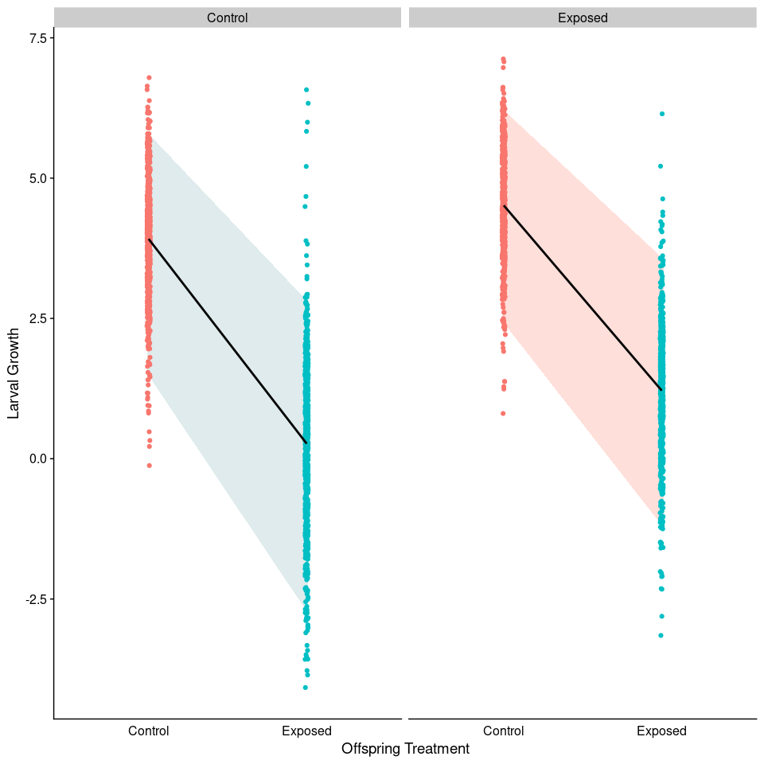

Animal Model Introduction
================

-   [Overview](#overview)
    -   [Origins in quantitative
        genetics](#origins-in-quantitative-genetics)
    -   [Animal model: Just a linear mixed
        model](#animal-model-just-a-linear-mixed-model)
    -   [Calculating heritability (and porportional contribution of
        other effects on phenotypic
        variance)](#calculating-heritability-and-porportional-contribution-of-other-effects-on-phenotypic-variance)
    -   [Implications for heritability](#implications-for-heritability)
    -   [Paper Discussions](#paper-discussions)
        -   [Wilson et al. 2010](#wilson-et-al-2010)
        -   [Thomson et al. 2018](#thomson-et-al-2018)
-   [Questions for oyster exposure to
    OA](#questions-for-oyster-exposure-to-oa)
    -   [Description](#description)
-   [Questions](#questions)
    -   [Q1 - What is the heritability of larvae growth in *C.
        virginica*?](#q1---what-is-the-heritability-of-larvae-growth-in-c-virginica)
    -   [Q2 - Does parental methylation correspond with larval
        growth?](#q2---does-parental-methylation-correspond-with-larval-growth)

# Overview

## Origins in quantitative genetics

A goal of quantitative genetics is to make inferences about inheritance,
evolutionary potential, and the genetic basis of a phenotype without
explicit knowledge of the actual genetic loci involved (Wilson et
al. 2010). This is possible through careful documentation of the
relationships among individuals, whereby pedigrees can be constructed.
Using pedigree data, when individuals that are more closely related are
also phenotypically more similar than unrelated individuals we can infer
that phenotypic variance is, in large part, genetically driven. Animal
models represent a (relatively recent) approach for examining the
genetic basis for phenotypic variance, utilizing a linear mixed model
framework.

In its simplest form, a single trait in a quantitative genetics
framework can be written as:

Where  is the
variance of the phenotype,
 is the genetic
variation, and 
is the residual (sometime called environmental) variation. From this
model is it possible to estimate the amount of phenotypic variation due
to genes (or genetic variation). Importantly, both sources of variation
( and
) can be further
partitioned. As an example,
 is frequently
thought of has the combination of additive genetic variation
(), epistatic
interactions
(),
and dominance effects
().
Moreover,  is
really a catch-all for all phenotypic variance not explained by genetic
variation. Some of this variance may be driven by environment, but other
non-genetic effects (e.g., maternal or epigenetic) may also explain
significant amounts of variation (more on this later).

 can be estimated
using some measure of relatedness. Relatedness can be calculated in a
couple of common ways:

1.  **Pedigree** - Using knowledge of the specific relationships among
    individuals within your population it is possible to construct a
    pedigree. Along with specific expectations about the average
    transmission rate of genetic material from parent to offspring, it
    is possible to calculated the level of relatedness among individuals
    with your samples. For example, we expect parents and offspring to
    share half their genetic material or (r=0.5), while first cousins
    are expected to share an eigth of their material (r=0.125). [Example
    from Hoy lab](http://hoylab.cornell.edu/relatedness.html)

1.  **Kinship Matrix** - More recently SNP data has been used to
    estimate kinship coefficients, a probabilistic estimate that a
    random allele from a given subject
     is
    identical-by-descent (ibd) to a allele in the same locus from a
    subject . By
    generating pairwise estimates of kinship you can create a kinship
    matrix. For diploid organisms, 2 x the kinship matrix is the
    relatedness matrix.

## Animal model: Just a linear mixed model

Animal models are simply linear mixed models that (at a minimum) include
a measure of animal relatedness as a **random effect** in a linear mixed
model. By fitting a simply linear mixed model with phenotype as the
response variable and a relatedness (or additive genetic similarity)
matrix as a random effect it is possible to decompose phenotypic
variance into different genetic and environmental sources and to
estimate key parameters such as the heritability of a trait or the
genetic correlations between traits (e.g. Réale, Festa-Bianchet &
Jorgenson 1999; Kruuk et al. 2000; Milner et al. 2000; Kruuk,Merila &
Sheldon 2001; Garant et al. 2004; Wilson et al.2005; Gienapp, Postma &
Visser 2006). The simplest model for this might look like:

Where  is the
phenotype for individual
,
 is the
population mean for the population,
 and
 are the genetic
and residual effects for individual
, respectively.

Beyond the simple model, animal models are extremely flexible, as we saw
in Thomson et al (2018). It is possible to add fixed effects (e.g., sex
or age) and even additional random effects to account for specific
sources of variation in your data (e.g., maternal ID or parental
epigenetic finger print).

## Calculating heritability (and porportional contribution of other effects on phenotypic variance)

There are two types of heritability, broad-sense and narrow-sense.

Broad-sense heritability is the proportion of phenotypic variance due to
genetic variance:

where  contains
additive ,
dominance , and
epistatic effects
.

While narrow-sense heritability is specifically the proportion of
phenotypic variance that is due to additive genetic variance:

.

Relatedness matrices (and pedigree) are measures of additive genetic
variation, consequently most animal models are estimating narrow-sense
heritability.

## Implications for heritability

Heritability has implications for how efficiently selection can act on a
phenotype. High heritability may indicate the trait has a substantial
potential to adaptive evolve, however, this is conditional on two main
factors:

-   There is variation in the trait
    -   Certain traits (such as the number of fingers on each hand) have
        very high heritability, but since there is little to no trait
        variation in most populations it will not adaptive evolve.
-   The trait needs to have fitness consequences
    -   A trait may be heritable and exhibit some variation, but if
        there is no selection on the trait (i.e., none zero effect on
        fitness), then it will not adaptive evolve.

The latter is not always easy to measure, so it is important to be
careful how heritability is interpreted.

## Paper Discussions

### Wilson et al. 2010

**Figure 1 - Different visualizations for relatedness / pedigree**

In (a) we have the classic pedigree tree, in (b) a relatedness matrix,
and (c) an offspring-parent table. The offspring-parent table is a
popular format for many animal model packages. Each row represents a
single individual, and includes information about it’s parents. For
parents in this table, or when the parents of an offspring are unknown
then an NA is used.

**Questions**

1.  What is the main purpose of an animal model?
2.  What does the measure of heritability actually mean?
3.  How does it relate to evolution and adaptation?
4.  What are some of the pitfalls when measuring heritability?
5.  Why sort of insight can bivariate animal models provide?
6.  Can animal models be used to predict evolution in future conditions?

### Thomson et al. 2018

**Questions**

1.  What do the authors mean by non-genetic?
2.  Why is considering non-genetic effects potentially important?
3.  What do you notice about heritability when you include more
    components in the model?

**Different Sources of Variation Effect Phenotype**

**Similarity Matrices Incorporated As Random Effects**

**Improved Partitioning Of Variance With More Effects**

# Questions for oyster exposure to OA

    ## Loading required package: Matrix

## Description

In 2018 we conducted an ocean acidification exposure experiment with the
aim of looking at the effects of inter-generational OA on oyster larvae
growth. In this experiment we exposed adult oysters to ambient or OA
conditions and then generated offspring from adults in both conditions
and exposed them to both OA and ambient treatments. We found that
offspring treatment and parental condition both impacted larvae growth
(figure below). As a follow-up to this work we are interested in
understanding the additive genetic and non-genetic sources of variation
that explain the variance (differences) we see in larval growth, then
leverage this information to better understand the evolutionary
potential of larval growth in response to OA and whether or not prior
parental exposure to OA effects the evolutionary potential.

<!-- -->

*Larvae Growth as a function of offspring and parental treatment. A)
Larval growth by offspring environmental pH. Boxes represent the 95%
quantile for offspring, separated by parental treatment. B) Larval
growth by offspring treatment (categorical). Boxes represent the 95%
quantile for offspring.*

# Questions

### Q1 - What is the heritability of larvae growth in *C. virginica*?

-   The main objective of this paper is to estimate heritability. This
    is a numeric quantity that describes the proportion of total
    phenotypic variation that is due to additive genetic variation and
    thus describes how quickly a population can respond to a unit of
    selection (Falconer & Mackay, 1996). Importantly, factors that can
    impact phenotypic variation (e.g. the environment) are also expected
    to influence estimates of heritability. Consequently, evaluating
    heritability within the context of current and future environments
    can give insights into the evolutionary potential of a phenotype.
-   In our experiment we were interested in examining larval growth
    responses in ambient (i.e., current) and future OA conditions in
    offspring created from parents that had or had not experienced OA.

**Part A** - Does heritability of larval growth differ depending on the
larval and/or adult environment? If so, how does it differ among ambient
and OA conditions and how does parental conditioning (i.e., exposure to
OA) impact estimates of heritability? **Part B** - Is there evidence
that plastic growth response (seen in Elises paper) are heritable? Does
heritability of plasticity differ when parents are conditioned to OA?

### Q2 - Does parental methylation correspond with larval growth?

**Part A** - Is parental methylation a significant explanatory variable
in a linear mixed model that examines the effects of intergenerational
OA exposure on larval growth?

-   In this question we use a linear mixed model that includes a measure
    of parental methylation as a covariate (fixed effect). The model
    will be an extension of the model that was run by Elise in her
    paper.

**Part B** - Is parental methylation an important component for
explaining variance in larvae growth using an animal model?

-   In this question we use the animal mode from Q1 with a measure of
    parental DNA methylation included as a random effect similar to the
    relatedness matrix or pedigree data used to represent additive
    genetic variance. Support for this approach found in [Thomson et al
    2018](https://journals.plos.org/plosone/article?id=10.1371/journal.pone.0197720).
