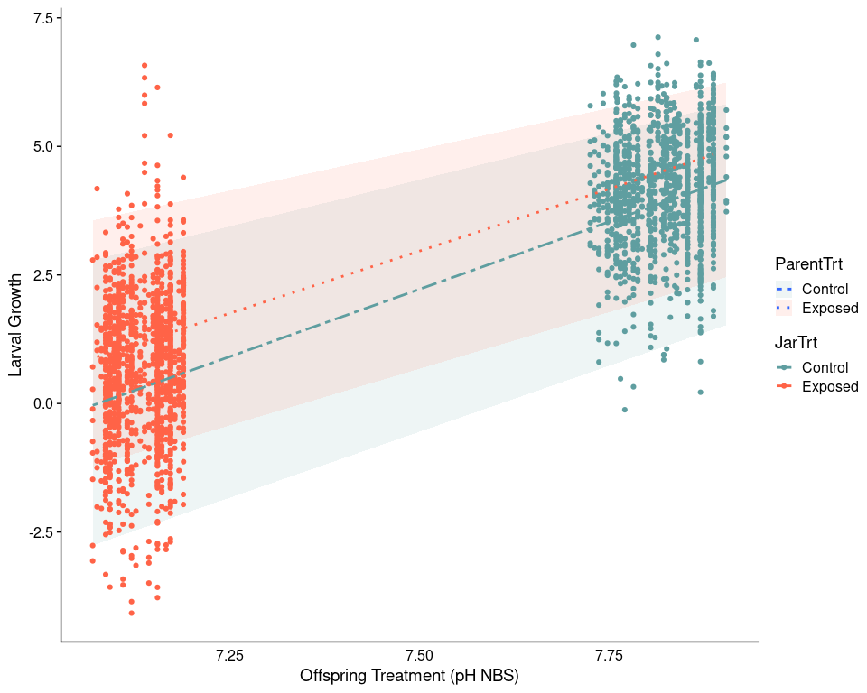

Animal Model Introduction
================

-   [Overview](#overview)
    -   [Origins in quantitative
        genetics](#origins-in-quantitative-genetics)
    -   [Animal model: Just a linear mixed
        model](#animal-model-just-a-linear-mixed-model)
    -   [Calculating heritability (and the proportional contribution of
        other effects on phenotypic
        variance)](#calculating-heritability-and-the-proportional-contribution-of-other-effects-on-phenotypic-variance)
    -   [Implications for heritability](#implications-for-heritability)
    -   [Paper Discussions](#paper-discussions)
        -   [Wilson et al. 2010 - An ecologist’s guide to the animal
            model](#wilson-et-al-2010---an-ecologists-guide-to-the-animal-model)
        -   [Thomson et al. 2018 - A guide to using a multiple-matrix
            animal model to disentangle genetic and nongenetic causes of
            phenotypic
            variance](#thomson-et-al-2018---a-guide-to-using-a-multiple-matrix-animal-model-to-disentangle-genetic-and-nongenetic-causes-of-phenotypic-variance)
-   [Example - C. virginica larval growth under OA from current and
    future parent
    exposures](#example---c-virginica-larval-growth-under-oa-from-current-and-future-parent-exposures)
    -   [Description](#description)
    -   [Main Experimental Factors](#main-experimental-factors)
    -   [Questions](#questions)
        -   [Stage 1 : What is the heritability of *C. virginica* larval
            growth and what are the significant variance components that
            determine larval growth variance in the animal
            model?](#stage-1--what-is-the-heritability-of-c-virginica-larval-growth-and-what-are-the-significant-variance-components-that-determine-larval-growth-variance-in-the-animal-model)
        -   [Preliminary Results](#preliminary-results)
        -   [Stages 2 + 3 : What is the genetic correlation between
            responses in current vs. future conditions? What is the
            heritability of larval growth plasticity to
            OA?](#stages-2--3--what-is-the-genetic-correlation-between-responses-in-current-vs-future-conditions-what-is-the-heritability-of-larval-growth-plasticity-to-oa)

# Overview

## Origins in quantitative genetics

A goal of quantitative genetics is to make inferences about inheritance,
evolutionary potential, and the genetic basis of a phenotype without
explicit knowledge of the actual genetic loci involved (Wilson et
al. 2010). This is possible through careful documentation of the
relationships among individuals, whereby pedigrees can be constructed.
Using pedigree data, when individuals that are more closely related are
also phenotypically more similar than unrelated individuals we can infer
that phenotypic variance is, in large part, genetically driven. Animal
models represent a (relatively recent) approach for examining the
genetic basis for phenotypic variance, utilizing a linear mixed model
framework.

In its simplest form, a single trait in a quantitative genetics
framework can be written as:

Where  is the
variance of the phenotype,
 is the genetic
variation, and 
is the residual (sometime called environmental) variation. From this
model is it possible to estimate the amount of phenotypic variation due
to genes (or genetic variation). Importantly, both sources of variation
( and
) can be further
partitioned. As an example,
 is frequently
thought of has the combination of additive genetic variation
(), epistatic
interactions
(),
and dominance effects
().
Moreover,  is
really a catch-all for all phenotypic variance not explained by genetic
variation. Some of this variance may be driven by environment, but other
non-genetic effects (e.g., maternal or epigenetic) may also explain
significant amounts of variation (more on this later).

 can be estimated
using a number of different approaches, including:

1.  **Pedigree** - Using knowledge of the specific relationships among
    individuals within your population it is possible to construct a
    pedigree. Along with specific expectations about the average
    transmission rate of genetic material from parent to offspring, it
    is possible to calculated the level of relatedness among individuals
    with your samples. For example, we expect parents and offspring to
    share half their genetic material or (r=0.5), while first cousins
    are expected to share an eighth of their material with each other
    (r=0.125). [Example from Hoy
    lab](http://hoylab.cornell.edu/relatedness.html)

Example of a pedigree

1.  **Kinship Matrix** - More recently SNP data has been used to
    estimate kinship coefficients, a probabilistic estimate that a
    random allele from a given subject
     is
    identical-by-descent (ibd) to a allele in the same locus from a
    subject . By
    generating pairwise estimates of kinship you can create a kinship
    matrix. For diploid organisms, 2 x the kinship matrix is the
    relatedness matrix.

Example of an kinship matrix

\#\#\# Additional components of phenotypic variance

*From Thomson et al. 2018 - These can include additive genetic variation
(), indirect effects
(different maternal effects, maternal environment -
, maternal genetic -
, etc ), and direct
effects (from environment,
, to induced epigenetic
effects, )*

It is worth noting that many of these effects may covary with one or
mutiple components, which can make attempts to disentangle the impact of
each component on phenotypic variance challenging.

## Animal model: Just a linear mixed model

Animal models are simply linear mixed models that (at a minimum) include
a measure of animal relatedness as a **random effect** in a linear mixed
model. By fitting a simply linear mixed model with phenotype as the
response variable and a relatedness (or additive genetic similarity)
matrix as a random effect it is possible to decompose phenotypic
variance into different genetic and environmental sources and to
estimate key parameters such as the heritability of a trait or the
genetic correlations between traits (e.g. Réale, Festa-Bianchet &
Jorgenson 1999; Kruuk et al. 2000; Milner et al. 2000; Kruuk,Merila &
Sheldon 2001; Garant et al. 2004; Wilson et al.2005; Gienapp, Postma &
Visser 2006). The simplest model for this might look like:

Where  is the
phenotype for individual
,
 is the
population mean for the population,
 and
 are the genetic
and residual effects for individual
, respectively.

Beyond the simple model, animal models are extremely flexible (as we saw
in Thomson et al (2018)). It is possible to add fixed effects (e.g., sex
or age) and even additional random effects to account for specific
sources of variation in your data (e.g., maternal ID or parental
epigenetic similarity matrix).

## Calculating heritability (and the proportional contribution of other effects on phenotypic variance)

Calculating heritability is simply the proportion of phenotypic variance
that is attributed to additive genetic variation:

Where  is the sum
of all all variance components in the model. **Note** A recent paper by
[Villemereuil et
al.](https://onlinelibrary.wiley.com/doi/full/10.1111/jeb.13232) argues
for the inclusion of fixed effect estimates as well as random effects
when calculating
.

**A note on heritabilities**

There are two types of heritability, broad-sense and narrow-sense.

Broad-sense heritability is the proportion of phenotypic variance due to
genetic variance:

where  contains
additive ,
dominance , and
epistatic effects
.

While narrow-sense heritability is specifically the proportion of
phenotypic variance that is due to additive genetic variance:

.

Relatedness matrices (and pedigree) are measures of additive genetic
variation, consequently most animal models are estimating narrow-sense
heritability.

## Implications for heritability

Heritability has implications for how efficiently selection can act on a
phenotype. High heritability may indicate the trait has a substantial
potential to adaptive evolve, however, this is conditional on two main
factors:

1.  There is variation in the trait

-   Certain traits (such as the number of fingers on each hand) have
    very high heritability, but since there is little to no trait
    variation in most populations it will not adaptive evolve.

1.  The trait needs to have fitness consequences

-   A trait may be heritable and exhibit some variation, but if there is
    no selection on the trait (i.e.,small or 0 selection coefficient) it
    will not adaptive evolve.

The latter is not always easy to measure, so it is important to be
careful how heritability is interpreted.

------------------------------------------------------------------------

## Paper Discussions

### Wilson et al. 2010 - An ecologist’s guide to the animal model

**Questions**

1.  What is the main purpose of an animal model?
2.  What does the measure of heritability actually mean?
3.  What are some of the pitfalls when measuring heritability?
4.  What sort of insight can bivariate animal models provide?
5.  How does it relate to evolution and adaptation?
6.  Can animal models be used to predict evolution in future conditions?

#### Important Figures

**Figure 1 - Different visualizations for relatedness / pedigree**

The way we represent individual similarity or relatedness can take many
forms, from a classic pedigree to an
 relatedness
matrix that shows how related individual
 is to individual
.

In (a) we have the classic pedigree tree, in (b) a relatedness matrix,
and (c) an offspring-parent table. The offspring-parent table is a
popular format for many animal model packages. Each row represents a
single individual, and includes information about it’s parents. For
parents in this table, or when the parents of an offspring are unknown
then an NA is used.

### Thomson et al. 2018 - A guide to using a multiple-matrix animal model to disentangle genetic and nongenetic causes of phenotypic variance

**Questions**

1.  What do the authors mean by non-genetic?
2.  Why is considering non-genetic effects potentially important?
3.  What do you notice about heritability when you include more
    components in the model?

#### Important Figures

**Thinking of components of phenotypic variances (random effects) as
similarity matrices**

Thomson et al. (2018) re-introduce a concept by Danchin et al (2011),
which aims at disentangling the main factors that contribute to
phenoypic variance through the use of multiple matrices that account for
different components that may contribute to phenotypic variance.

**Improved Partitioning Of Variance With More Effects**

By including additional components of variation we see that both
additive genetic variation
 and residual variation
 components shrink. This
has two implications: \* First, heritability decreases \* Second, more
of the total phenotypic variance is now be explained by measured
components of variation. In other words, we are better representing the
sources of phenotypic variance with the measured variables in our model.

------------------------------------------------------------------------

# Example - C. virginica larval growth under OA from current and future parent exposures

    ## Loading required package: Matrix

## Description

In 2018 we conducted an ocean acidification exposure experiment with the
aim of looking at the effects of inter-generational OA on oyster larvae
growth. In this experiment we exposed adult oysters to ambient or OA
conditions and then generated offspring from adults in both conditions
and exposed them to both OA and ambient treatments. We found that
offspring treatment and parental condition both impacted larvae growth
(figure below). As a follow-up to this work we are interested in
understanding the additive genetic and non-genetic sources of variation
that explain the variance (differences) we see in larval growth, then
leverage this information to better understand the evolutionary
potential of larval growth in response to OA and whether or not prior
parental exposure to OA effects the evolutionary potential.

<!-- -->

*Larvae Growth as a function of offspring and parental treatment. A)
Larval growth by offspring environmental pH. Boxes represent the 95%
quantile for offspring, separated by parental treatment. Boxes represent
the 95% quantile for offspring.*

## Main Experimental Factors

**Response Variable**

-   Larval Growth

**Explanatory Variable**

-   Offspring environment
-   Parental environment
-   Maternal effect (ID)
-   Parental methylation fingerprint

## Questions

### Stage 1 : What is the heritability of *C. virginica* larval growth and what are the significant variance components that determine larval growth variance in the animal model?

Taking a classic approach to trait variance and heritability - I take a
look at larval growth of each individual separately. The effect of
offspring environment is included as a random effect in the model
(similar to how Thomson et al. 2018).

**A** - Does heritability of larval growth differ depending on the
larval and/or adult environment? If so, how does it differ among ambient
and OA conditions and how does parental conditioning (i.e., exposure to
OA) impact estimates of heritability?

-   **A1** - Estimate heritability for each parent and offspring
    environment without parental methylation.
    -   4 models - One for each parent-offspring treatment combination.
    -   
-   **A2** - Estimate heritability for each parent environment without
    parental methylation and include offspring environment as a random
    effect.
    -   2 models - One for each parent environment.
    -   
-   **A3** - Estimate heritability without parental methylation and
    include offspring environment as a random effect.
    -   1 model
    -   

**B** - How does the inclusion of parental methylation impact estimates
of heritability? Does parental methylation explain variation in
phenotype that is not otherwise explained by either additive genetic
variation or parental environment?

-   **B1** - Estimate heritability with parental methylation and include
    offspring environment as a random effect.
    -   1 model
    -   
-   **B2** - Model comparison
    -   Does the inclusion of DNA methylation effect estimates of
        heritability?
    -   Does including methylation significantly reduce the amount of
        residual variation?

### Preliminary Results

**Relatedness Matrix**

**A1 - Examples of variance components from the model when run as
separate parent-offspring treatments**

**A1 - Heritability and maternal effects for each parent-offspring
combination**

*Animal model was run in MCMCglmm with a number of different model
parameterizations (x-axis). Overall, estimates were similar regardless
of parameterization*

#### Interpretation so far….

-   Heritability is low, but often none zero.
    -   These values are consistent with heritability of growth observed
        in other species (e.g., mussels in Sunday et al 2011).
    -   Under certain selection scenarios (modeled in Sunday et
        al. 2011) these heritabilities are sufficient to impact
        evolutionary potential.
-   Models appears to struggle deciding on the contribution of additive
    genetic vs. maternal effects.
-   Does appear to be some differences in heritability depending on
    parent-offspring combination.

#### Next Steps

-   Next up is fitting more complex models that include treatment
    (either parental, offspring, or both) as well as parental
    methylation in the model and evaluating performance.

1.  We know both parental environment and offspring environment have
    significant effects from Elises model, but including them in the
    model as random effects will allow us to specifically partition
    phenotypic variation by both parental and offspring environments, to
    examine the magnitude of an environmental effect vs. additive
    genetic variation.

### Stages 2 + 3 : What is the genetic correlation between responses in current vs. future conditions? What is the heritability of larval growth plasticity to OA?

When considering heritability and selection acting on a trait in
multiple environments (i.e., ambient and future OA conditions). There
are two other related questions that are often asked:

1.  What is the genetic covariance in a trait observed in multiple
    conditions?
2.  What is the selection on the reaction norm (plasticity of a trait)?

Both questions are similar in that they are interested in understanding
the performance of a phenotype in at least two environments. The first
question can be addressed using a bivariate model described by Wilson et
al 2010, whereby you include the same trait under different conditions
as your response variables. While selection on the reaction norms may be
performed in multiple ways, but one way is using linear regression to
generate slopes (reaction norms) for trait performance across the
different conditions. This slope can then be used in an animal model to
examine the heritability of plasticity (see Weis et al. 1990 for
example).

The downside of these approaches:

1.  In the bivariate model you should ideally have paired data (measures
    of phenotype for the same individual across both environments)
2.  When estimating plasticity at the family-level (our only option here
    since we don’t have multiple phenotypes for the same individual) the
    use of linear regression compresses all of our individual
    observations into a single family observation (i.e., the slope of
    the regression), which substantially reduces our power. This
    approach is based on work done by Weiss et al 1990.
