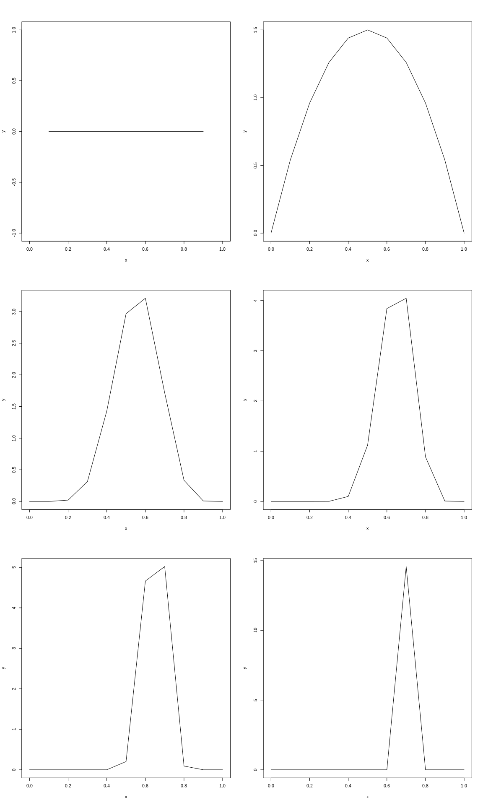
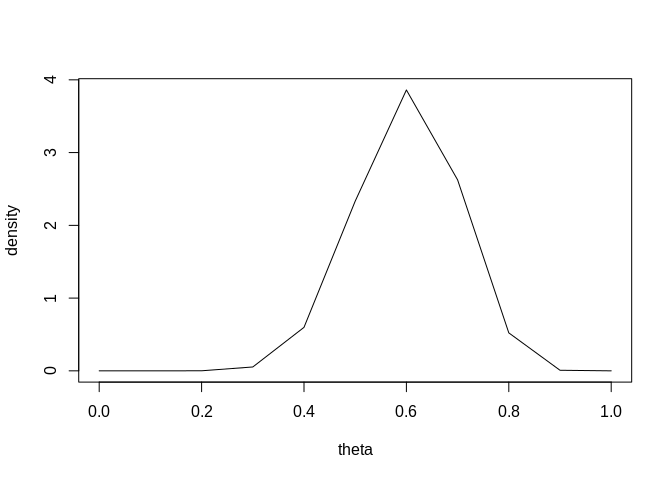
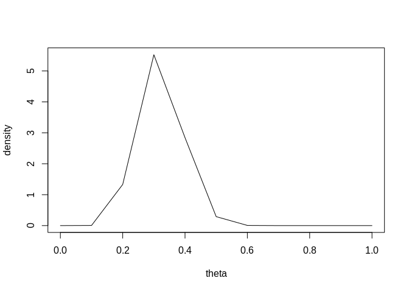

Introduction to Bayesian Statistics
================

### Initial Thoughts

The intent of this section is to provide some basic background and
context for understanding Bayesian statistics and inference. The goal is
to illustrate how this approach differs from frequentist statistics and
offer a practical overview of the core Bayesian principles we will need
down the road when we look at more complicated examples of Bayesian
models.

## 1 Frequentist vs. Bayesian

### 1.1 Probabilities

One way to to think about the division between a frequentist and
bayesian approach is to consider the underlying principle of probability
as it is thought of in the two different methods:

**R.A. Fisher – Probability as Long-Term Frequency (a frequentist
approach):**

    The probability of an event is equal to the long-term frequency of the event occurring when the same process is repeated multiple times. 

As per this definition, the probability of a coin toss resulting in
heads is 0.5 because rolling the die many times over a long period
results roughly in those odds.

**Rudolf Carnap - Logical Probability (a bayesian
    approach):**

    The probability of an event is measured by the degree of logical support there is for the event to occur. According to this definition, a probability is nothing but a generalization of classical logic.

The *first definition illustrates a core tenant of frequentist
statistics*; only events that are both random and repeatable (e.g. coin
flips) have probabilities. This is because we can only know the
probability of an event if we have evaluated the likelihood of that
event over many trials. This means that frequentists would not attach
prior probabilities to any statistical test (or hypothesis).

If we consider the second definition, we can see Bayesians have a
greater degree of flexibility in their interpretation. Practically
speaking, Bayesians would argue that we can often leverage information
from the sample data to estimate prior probabilities of certain events
(or hypotheses) occuring.

### 1.2 Conceptual Example

Say, the problem involves estimating the average height of all men who
are currently in or have ever attended college. We assume that the
height has a normal distribution and that the standard deviation is
available. Therefore, all we need to estimate is the mean.

**Frequentist Approach**

A frequentist would reason that since mean height is an actual number,
you cannot assign a random probability to it being equal to, less than,
or greater than a certain value.

Therefore, a frequentist would collect some sample data from the
universal data and estimate the mean as the value which is most
consistent with the actual mean. This is known as a maximum likelihood
estimate. When the distribution is normal, this estimate is simply the
mean of the sample.

**Bayesian Approach**  
A Bayesian, on the contrary, would reason that although the mean is an
actual number, there is no reason not to assign it a probability. The
Bayesian approach will do so by defining a probability distribution
based on possible values of the mean.

This distribution will then be updated using data from the sample. This
update is done by applying the Baye’s theorem.

The sample data makes the probability distribution narrower around the
parameter’s true and unknown value. The Baye’s theorem is applied to
each possible value of the parameter. Here’s a short video highlighting
the differences in Frequentist vs Bayesian ab
testing.

[Link to youtube description](https://youtu.be/r76oDIvwETI)

### 1.3 Key Differences

**(i) Use of prior probabilities**  
The use of prior probabilities in the Bayesian technique is the most
obvious difference between the two. Frequentists believe that there is
always a bias in assigning probabilities which makes the approach
subjective and less accurate. Bayesians, on the other hand, believe that
not assigning prior probabilities is one of the biggest weaknesses of
the frequentist approach.

**(ii) Data Prediction**  
Since the Frequentists don’t believe in assigning prior probabilities,
their estimate is based on the maximum likelihood point. Bayesians, on
the other hand, have a complete posterior distribution over possible
parameter values. This allows them to account for the uncertainty in the
estimate by integrating the entire distribution, and not just the most
likely value.

**(iii) Mitigating Uncertainty**  
The Bayesian approach to mitigating uncertainty is by treating it
probabilistically. Frequentists don’t have that luxury. However, this
doesn’t mean that there is no uncertainty in the frequentist approach.
The estimate derived from sample data can, and is often, wrong. In order
to mitigate this uncertainty, Frequentists use two techniques.

1)  The use of confidence intervals.  
2)  Null hypothesis significance testing (NHST) which is related to
    P-values.

## 2 Bayesian Statistics - A practical introduction

“Bayesian statistics is a mathematical procedure that applies
probabilities to statistical problems. It provides people the tools to
update their beliefs in the evidence of new data.”

To see how this may be important consider the example:

In 4 championship F1 races between Niki Lauda and James hunt, Niki won 3
times while James managed only 1.

Given this information who would you expect to win in their 5th race?

Most likely you would say Niki Lauda.

But what if we knew some additional details about their previous races?

What if you are told that it rained once when James won and once when
Niki won and it is definite that it will rain on the next date. Would
this information effect your prediction?

By intuition and logical reasoning, we might think this new information
would dramatically increase the likelihood of James winning. But the
question is: how much ?

To approach this problem of how much, we need to become familiar with
some core concepts including conditional probability and bayes theorem.

### 2.1 Conditional Probability

We can define conditional probability as : “The probability of and event
A given B equals the probability of B and A happening together divided
by the probability of
B.”

For example: Assume two partially intersecting sets A and B as shown
below.

Set A represents one set of events and Set B represents another. We wish
to calculate the probability of A given B has already happened. Lets
represent the happening of event B by shading it with red.

Now since B has happened, the part which now matters for A is the part
shaded in blue which is interestingly \(A\cap B\).  
So, the probability of A given B turns out to
be:

This can also be written as:

This is known as the **conditional probability**..

**Lets lets revisit the racing problem….**

Suppose, B be the event of winning of James Hunt. A be the event of
raining. Therefore,

`P(A)` = 1/2, since it rained twice out of four days. `P(B)` = 1/4,
since James won only one race out of four. `P(A|B)` = 1, since it rained
every time when James won.

Substituting the values in the conditional probability formula, we get
the probability to be around 50%, which is almost the double of 25% (1
out of 4 races) when rain was not taken into account.

This further strengthened our belief of James winning in the light of
new evidence i.e rain.

Conditional Probability is the basis of the **Bayes Theorem** and a
fundamental part of Bayesian Inference.

### 2.2 Bayes Theorem

Bayes Theorem comes into effect when multiple events form an exhaustive
set with another event B.

B can be written
as:

The probability of B can be written
as:

Where,

So, using the conditional probability equation and a little bit of
reconfiguring we can
derive:

This is the **Bayes Theorem Equation**.

### 2.3 Bayesian Inference

The field of bayesian statistics is about leveraging this Bayes Theorem
equation to make inferences about the probability of a particular
hypothesis. Lets consider a set of coin tosses to explore this idea:

An important part of bayesian inference is the establishment of
**parameters** and **models**.

Models are the mathematical formulation of the observed events.
Parameters are the factors in the models affecting the observed data.
For example, in tossing a coin, **fairness of coin** may be defined as
the parameter of coin denoted by `θ`. The outcome of the events may be
denoted by `D`.

From this we might ask the question - What is the probability of 4 heads
out of 9 tosses(`D`) given the fairness of coin (`θ`)? Or if we use
earlier notation : `P(D|θ)`.

Whats more, we might be first tempted to ask about the fairness of the
coin.

So we might first ask : what is the probability of the coin being fair
(θ=0.5) given the given `D` outcomes?

Lets represent it using Bayes Theorem:

`P(θ|D)=(P(D|θ) X P(θ))/P(D)`

Here, **`P(θ)`** is the **prior** - the strength of our belief in the
fairness of coin before the toss. It is perfectly okay to believe that
coin can have any degree of fairness between 0 and 1.

**`P(D|θ)`** is the likelihood of observing our result given our
distribution for `θ`. If we knew that coin was fair, this gives the
probability of observing the number of heads in a particular number of
flips.

**`P(D)`** is the evidence. This is the probability of data as
determined by summing (or integrating) across all possible values of
`θ`, weighted by how strongly we believe in those particular values of
`θ`.

*If we had multiple views of what the fairness of the coin is (but
didn’t know for sure), then this tells us the probability of seeing a
certain sequence of flips for all possibilities of our belief in the
coin’s fairness.*

**`P(θ|D)`** is the posterior belief of our parameters after observing
the evidence (i.e the number of heads).

Next step, lets a little dive deeper into mathematical implications of
this concept.  
To define our model correctly, we need two mathematical models before
hand. One to represent **the likelihood function - P(D|θ)** and the
other for representing the distribution of **prior beliefs - P(θ)**. The
product of these two gives the **posterior belief - P(θ|D)**
distribution.

*Since prior and posterior are both beliefs about the distribution of
fairness of coin, intuition tells us that both should have the same
mathematical form. Keep this in mind. We will come back to it
again.*

## 3 Likelihood estimation and generating prior and posterior distribution

Next, lets continue with the coin flipping example and derive the
likelihood function, prior and posterior distributions.

**Likelihood Function - bernoulli trails (since data is binomial)**

Recall the probability of observing heads/tails depends upon the
fairness of coin
(`θ`).

  
\[If coin is fair θ = 0.5, probability of observing heads (y=1) is
0.5\]

  
\[If coin is fair θ = 0.5, probability of observing tails(y=0) is 0.5\]

It is worth noticing that representing 1 as heads and 0 as tails is just
a mathematical notation to formulate a model. We can combine the above
mathematical definitions into a single definition to represent the
probability of both the
outcomes.

## 3.1 Likelihood function

This is called the **Bernoulli Likelihood Function** and the task of
coin flipping is called Bernoulli’s
trials.

And, when we want to see a series of heads or flips, its probability is
given
by:

Furthermore, if we are interested in the probability of number of heads
**z** turning up in **N** number of flips then the probability is given
by:

### 3.2 Prior Distribution

This distribution is used to represent our strengths on beliefs about
the parameters based on the previous experience.

But, what if one has no previous experience?

Don’t worry. Mathematicians have devised methods to mitigate this
problem too. It is known as uninformative priors. I would like to inform
you beforehand that it is just a misnomer. Every uninformative prior
always provides some information event the constant distribution prior.

Well, the mathematical function used to represent the prior beliefs is
known as beta distribution. It has some very nice mathematical
properties which enable us to model our beliefs about a binomial
distribution.

Probability density function of `beta distribution` is of the form
:

where, our focus stays on numerator. The denominator is there just to
ensure that the total probability density function upon integration
evaluates to 1.

`α` and `β` are called the shape deciding parameters of the density
function. Here `α` is analogous to number of heads in the trials and `β`
corresponds to the number of tails. The diagrams below will help you
visualize the beta distributions for different values of `α` and
`β`.

You too can draw the beta distribution for yourself using the following
code in R:

    library(stats)
    par(mfrow=c(3,2))
    x=seq(0,1,by=0.1)
    alpha=c(0,2,10,20,50,500)
    beta=c(0,2,8,11,27,232)
    for(i in 1:length(alpha)){
      y <- dbeta(x,shape1=alpha[i],shape2=beta[i])
      plot(x,y,type="l")
    }

<!-- -->

Note: `α` and `β` are intuitive to understand since they can be
calculated by knowing the mean (`μ`) and standard deviation (`σ`) of the
distribution. In fact, they are related
as:

If mean and standard deviation of a distribution are known , then there
shape parameters can be easily calculated.

**Inference drawn from graphs above**:

1)  When there was no toss we believed that every fairness of coin is
    possible as depicted by the flat line.  
2)  When there were more number of heads than the tails, the graph
    showed a peak shifted towards the right side, indicating higher
    probability of heads and that coin is not fair.  
3)  As more tosses are done, and heads continue to come in larger
    proportion the peak narrows increasing our confidence in the
    fairness of the coin value.

### 3.3 Posterior Distribution

The reason that we chose prior belief is to obtain a beta distribution.
This is because when we multiply it with a likelihood function,
posterior distribution yields a form similar to the prior distribution
which is much easier to relate to and understand. If this much
information whets your appetite, I’m sure you are ready to walk an extra
mile.

Let’s calculate posterior belief using bayes theorem.

**Calculating posterior using Bayes Theorem**

Now, our posterior belief
becomes,

Now, our posterior
becomes,

This is interesting. Just knowing the mean and standard distribution of
our belief about the parameter `θ` and by observing the number of heads
in N flips, we can update our belief about the model parameter(`θ`).

Lets understand this with the help of a simple example:

Suppose, you think that a coin is biased. It has a mean (`μ`) bias of
around 0.6 with standard deviation of 0.1.

Then ,

`α = 13.8` , `β = 9.2`

i.e our distribution will be biased on the right side. Suppose, you
observed 80 heads (z=80) in 100 flips(N=100). Let’s see how our prior
and posterior beliefs are going to
look:

Lets visualize both the beliefs on a graph:

    library(stats)
    x = seq(0,1,by=0.1)  
    alpha = c(13.8,93.8)  
    beta = c(9.2,29.2)  
    for(i in 1:length(alpha)){
      y <- dbeta(x,shape1=alpha[1],shape2=beta[i])
      plot(x,y,type="l",xlab="theta",ylab="density")
    }

<!-- --><!-- -->

As more and more flips are made and new data is observed, our beliefs
get updated. This is the real power of Bayesian Inference.

## 4 Thoughts on significance testing

Without going into the rigorous mathematical structures, this section
will provide you a quick overview of different approaches of frequentist
and bayesian methods to test for significance and difference between
groups and which method is most reliable.

### 4.1 p-value

n this, the t-score for a particular sample from a sampling distribution
of fixed size is calculated. Then, p-values are predicted. We can
interpret p values as (taking an example of p-value as 0.02 for a
distribution of mean 100) : There is 2% probability that the sample will
have mean equal to 100.

This interpretation suffers from the flaw that for sampling
distributions of different sizes, one is bound to get different t-score
and hence different p-value. It is completely absurd. A p-value less
than 5% does not guarantee that null hypothesis is wrong nor a p-value
greater than 5% ensures that null hypothesis is right.

### 4.2 Confidence Interval

Confidence Intervals also suffer from the same defect. Moreover since
C.I is not a probability distribution , there is no way to know which
values are most probable.

### 4.3 Bayes Factor

Bayes factor is the equivalent of p-value in the bayesian framework.
Lets understand it in an comprehensive manner.

The null hypothesis in bayesian framework assumes ∞ probability
distribution only at a particular value of a parameter (say `θ` = 0.5)
and a zero probability else where. (M1)

The alternative hypothesis is that all values of `θ` are possible, hence
a flat curve representing the distribution. (M2)

Now, posterior distribution of the new data looks like below.

significance, bayes factor, hypothesis testing

Bayesian statistics adjusted credibility (probability) of various values
of `θ`. It can be easily seen that the probability distribution has
shifted towards M2 with a value higher than M1 i.e M2 is more likely to
happen.

Bayes factor does not depend upon the actual distribution values of `θ`
but the magnitude of shift in values of M1 and M2.

In panel A (shown above): left bar (M1) is the prior probability of the
null hypothesis.

In panel B (shown), the left bar is the posterior probability of the
null hypothesis.

Bayes factor is defined as the ratio of the posterior odds to the prior
odds,

To reject a null hypothesis, a BF \<1/10 is preferred.

We can see the immediate benefits of using Bayes Factor instead of
p-values since they are independent of intentions and sample size.

# 5 End Thoughts

Next topics I will cover are:  
\* Dimensionality Reduction techniques using MCMC (Markov Chain Monte
Carlo) algorithms  
\* Bayesian regression model  
\* Performing Bayesian regression in R with BRMS package
