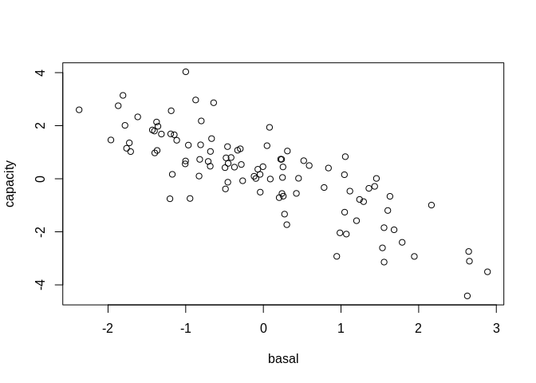
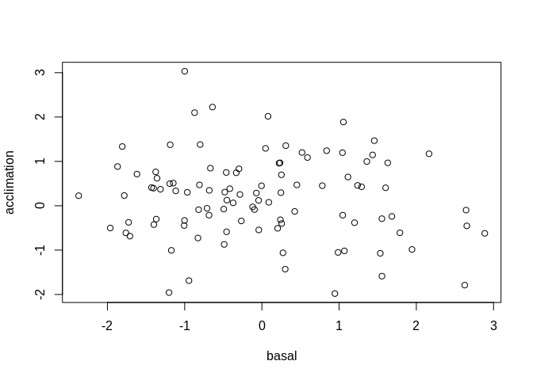
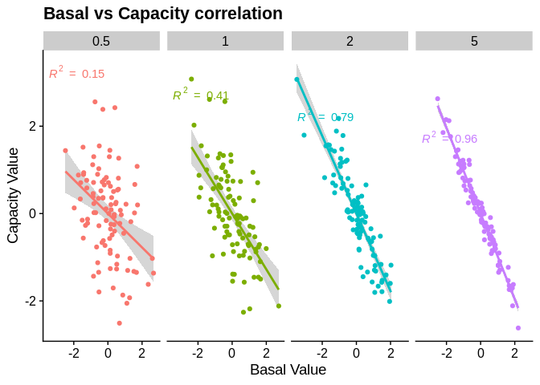

Thoughts on spurious correlations driving correlations between basal and
acclimation responses
================
3/19/2020

## Toy example of a spurious correlation between unrelated variables

Here I randomly generate values from a normal distribution to represent
independent basal and acclimation variables. Next I substract the basal
value from the acclimation value to get our capacity variable (similar
to what was done in the Gerken paper). Finally, we examine the
correlation between the capacity variable and the basal
variable.

``` r
# Simulated variables drawn from a normal dist. with identical variance (sd)
basal <- rnorm(100,0,1)
acclimation <- rnorm(100,0,1)
# Calculate capacity
capacity <- acclimation - basal
```

### Capacity vs. basal

``` r
plot(capacity~basal)
```

<!-- -->

``` r
summary(lm(capacity~basal))
```

    ## 
    ## Call:
    ## lm(formula = capacity ~ basal)
    ## 
    ## Residuals:
    ##      Min       1Q   Median       3Q      Max 
    ## -2.24412 -0.60112  0.04203  0.53833  2.76418 
    ## 
    ## Coefficients:
    ##             Estimate Std. Error t value Pr(>|t|)    
    ## (Intercept)  0.18140    0.09293   1.952   0.0538 .  
    ## basal       -1.08763    0.07785 -13.971   <2e-16 ***
    ## ---
    ## Signif. codes:  0 '***' 0.001 '**' 0.01 '*' 0.05 '.' 0.1 ' ' 1
    ## 
    ## Residual standard error: 0.929 on 98 degrees of freedom
    ## Multiple R-squared:  0.6657, Adjusted R-squared:  0.6623 
    ## F-statistic: 195.2 on 1 and 98 DF,  p-value: < 2.2e-16

``` r
cor(capacity,basal)
```

    ## [1] -0.8159302

### Acclimation vs. basal

``` r
plot(acclimation~basal)
```

<!-- -->

``` r
summary(lm(acclimation~basal))
```

    ## 
    ## Call:
    ## lm(formula = acclimation ~ basal)
    ## 
    ## Residuals:
    ##      Min       1Q   Median       3Q      Max 
    ## -2.24412 -0.60112  0.04203  0.53833  2.76418 
    ## 
    ## Coefficients:
    ##             Estimate Std. Error t value Pr(>|t|)  
    ## (Intercept)  0.18140    0.09293   1.952   0.0538 .
    ## basal       -0.08763    0.07785  -1.126   0.2631  
    ## ---
    ## Signif. codes:  0 '***' 0.001 '**' 0.01 '*' 0.05 '.' 0.1 ' ' 1
    ## 
    ## Residual standard error: 0.929 on 98 degrees of freedom
    ## Multiple R-squared:  0.01276,    Adjusted R-squared:  0.00269 
    ## F-statistic: 1.267 on 1 and 98 DF,  p-value: 0.2631

``` r
cor(acclimation,basal)
```

    ## [1] -0.1129789

### Thoughts

Generally, we see that there is no relationship between survivorship in
our acclimation treatment vs our basal treatment (which we would expect
given the way we simulated the data). However, there was a very
significant relationship betwenen acclimation capacity and the basal
treatment. Specifically, we see a strong negative correlation that is
being driven by the use of the basal tolerance variable in the
calculation of the acclimation capacity (i.e. a spurious correlation
driven by a variable being correlated with itself). Moreover, if we look
at the R2 value we see that ~50% of the variation in our capacity
variable can explained by the basal variable. This makes sense since we
calculated acclimation capacity as an additive combination of the basal
and acclimation variables, which were generated by drawing from
identical normal distributions with equal variances. This means that on
average we would only expect half of the variation to be due to the
basal value in the calculation and half from the acclimation value. This
also indicates that the strength of the spurious correlation could be
driven by the relative amount of variance in the basal vs. acclimation
components of our acclimation capacity
calculation.

## Quick examination of spurious correlation strengths under a range of basal tolerance variances

Here we take a quick look at unequal variances among our basal
vs. acclimation variables and its impact on the spurious correlation
between acclimation capacity and basal tolerance:

We do this by simulating a basal tolerance variable that has half
(0.5),equal (1), twice (2), triple (3), and five times the standard
deviation as our acclimation variable (5).

``` r
library(reshape,quietly = TRUE)
library(ggplot2,quietly = TRUE)
library(ggpmisc,quietly = TRUE)
library(cowplot,quietly = TRUE)
```

    ## 
    ## ********************************************************

    ## Note: As of version 1.0.0, cowplot does not change the

    ##   default ggplot2 theme anymore. To recover the previous

    ##   behavior, execute:
    ##   theme_set(theme_cowplot())

    ## ********************************************************

    ## 
    ## Attaching package: 'cowplot'

    ## The following object is masked from 'package:reshape':
    ## 
    ##     stamp

``` r
# This is to simulate variable levels of variance in our basal variable (while keeping the acclim
# ation value unchanged)
rel_deviation <-c(0.5,1,2,5)

bas_draw <- function(x){return(rnorm(100,0,c(x)))}
basal <-sapply(rel_deviation,bas_draw)
acclimation <- rnorm(100,0,1)
capacity <- acclimation - basal
#Covert in to data frames
acc_df <- data.frame(acclimation)
cap_df <- data.frame(capacity)
bas_df <- data.frame(basal)
# Scale 
bas_df <- data.frame(sapply(bas_df,scale))
cap_df <- data.frame(sapply(cap_df,scale))

## Convert into long form
# Add temp column names
colnames(bas_df) <- rel_deviation
colnames(cap_df) <- rel_deviation
# Melt
basal_long <- melt(bas_df)
```

    ## Using  as id variables

``` r
cap_long <- melt(cap_df)
```

    ## Using  as id variables

``` r
# Combine acclimation,basal,capacity value into single long dataframe
all_long <- cbind(acc_df,basal_long,cap_long[,2])
colnames(all_long) <- c("Acclimation_Value","Relative_Basal_Variance","Basal_Value","Capacity_Value")

my_eq <- y~x
ggplot(all_long,aes(y=Capacity_Value,x=Basal_Value,colour=as.factor(Relative_Basal_Variance))) +
  geom_smooth(method="lm",formula=my_eq) +
   stat_poly_eq(formula = my_eq, 
               aes(label = paste(..rr.label.., sep = "~~~")), 
               parse = TRUE) +
  labs(x = "Basal Value",y="Capacity Value",title="Basal vs Capacity correlation") +
  geom_point() + 
  facet_grid(.~as.factor(Relative_Basal_Variance)) +
  theme_cowplot() + 
  theme(legend.position = "none")
```

<!-- -->

``` r
corr_vec <- NULL
for(i in 1:ncol(bas_df)){
  corr_vec <- c(corr_vec,cor(bas_df[,i],cap_df[,i]))
}
names(corr_vec) <- rel_deviation
```

### Estimated correlation between acclimation capacity and basal tolerance

    ##        0.5          1          2          5 
    ## -0.3880138 -0.6386206 -0.8881132 -0.9808886

### Thoughts

The strength of the correlation increases as the variance in the basal
tolerance variable increases relative to the acclimation variable. This
may be particularly problematic in the context of the Gerken paper if
acclimation not only increases survivorship but also decreases the
variance in survivorship among lineages. Without the data it is
difficult to say with certainty if this is happening. However, looking
at their barplot of survivorship to acute stress (S2.1) for each
treatment (basal and short and long term acclimation) it does seem that
the basal treatments tend to have equal or often times larger variances
than the corresponding acclimation treatments. In particular, DACC has
one of the lowest relative variances and DACC capacity also has one of
the highest correlations with basal tolerance, which is consistent with
this pattern being driven by a spurious correlation.
